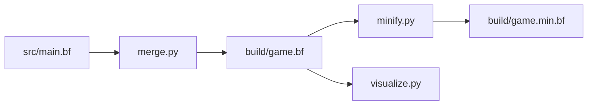

# 🧠🕹️ Brainfuck Ping‑Pong

>Beauttah K.

<div align="center">


</div>

---

## ✨ What is this?

**Brainfuck Ping‑Pong** is a modular, build‑driven Pong‑style game written in **Brainfuck**, treated as a *target language* rather than a lifestyle choice.

This project proves that even one of the most minimal languages ever created can support:
- game loops
- physics
- rendering
- tooling
- sane project structure

All without losing your mind (much).

---

## 🗂️ Project Structure

| Folder | Purpose |
|------|--------|
| `src/` | Brainfuck source split by responsibility |
| `src/logic/` | Ball, paddle, AI, scoring logic |
| `src/render/` | ASCII rendering & screen control |
| `levels/` | Encoded configuration & modes |
| `tools/` | Merge, minify, visualize (Python) |
| `build/` | Generated Brainfuck output |
| `docs/` | Design & memory layout |
| `tests/` | Isolated Brainfuck logic tests |

---

## 🎮 Gameplay Concept

Turn‑based Pong rendered in ASCII.

- Single‑character input per frame
- Deterministic updates
- No real‑time dependency
- Works in standard Brainfuck interpreters

### Controls

| Key | Action |
|---|---|
| `w` / `s` | Left paddle up / down |
| `o` / `l` | Right paddle up / down |
| other | no‑op |

---

## 🧠 Memory Tape Map (excerpt)

| Cell | Meaning |
|---|---|
| 0 | ball_x |
| 1 | ball_y |
| 2 | ball_dx (0=left, 1=right) |
| 3 | ball_dy (0=up, 1=down) |
| 4 | left_paddle_y |
| 5 | right_paddle_y |
| 6 | input |
| 7 | temp |

---

## 🖼️ ASCII Art Preview

<table>
<tr>
<td>

```
+---------+
|    o    |
|         |
||       ||
|         |
+---------+
```

</td>
<td>

```
FRAME 42
BALL: (4,2)
DX: →  DY: ↓
```

</td>
</tr>
</table>

---

## 🔨 Build Pipeline



### Commands

```bash
python tools/merge.py
python tools/minify.py
python tools/visualize.py
```

---

## 🧪 Testing Philosophy

Each subsystem can be validated independently using small Brainfuck programs:

- Ball movement
- Paddle bounds
- Input decoding

This keeps complexity *localized*, which is critical in Brainfuck.

---

## 🧬 Design Philosophy

- Brainfuck is treated as **assembly**, not a joke
- Tooling > heroics
- Readability first, minification later
- Everything is replaceable

> If it can’t be merged, visualized, or tested — it doesn’t belong here.

---

## 🚧 Status

This project is **actively evolving**.

Upcoming milestones:
- collision detection
- full board renderer
- AI paddle
- instruction‑count optimization

---

## 🏴 Why?

Because:
- constraints sharpen ideas
- absurdity reveals structure
- and nobody said you *shouldn’t* make games in Brainfuck

---

## 📜 License

Public domain / do whatever / blame entropy.

---

<div align="center">

**Have fun breaking the tape.**

</div>

